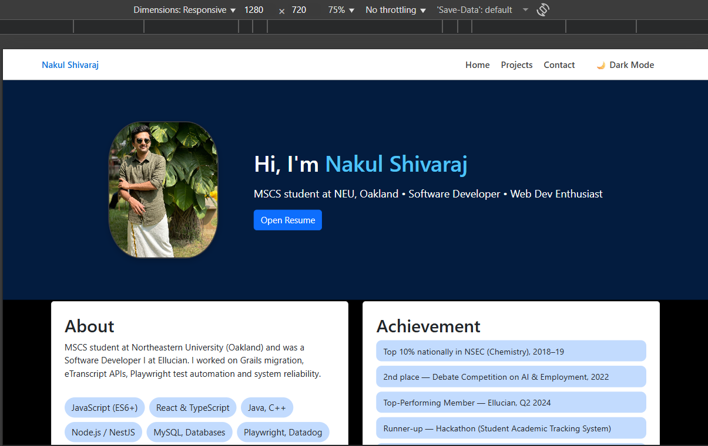
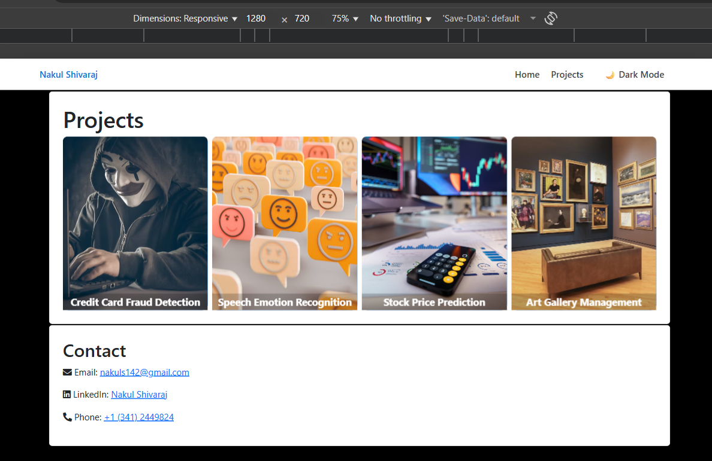

# Personal Homepage — Nakul S

**Author:** Nakul S  
**Class:** MSCS — Web Dev Project 1  
**Objective:** Build a static personal homepage using HTML5, CSS3 and ES6 modules. Includes an original interactive timeline component.

## What I included
- `index.html` (homepage) and `projects.html` (project gallery)
- ES6 modules in `/js` (`main.js`, `timeline.js`)
- Organized folders: `/css`, `/js`, `/images`
- `resume.pdf` (copied from provided CV)
- Prettier & ESLint config files
- MIT license

## How to run locally
1. Unzip or clone the repository.
2. From the project root, run a static server:
   - `python3 -m http.server 8000`
   - or `npx http-server . -p 8080`
3. Open `http://localhost:8000/index.html` in your browser.

## Accessibility & Validation
- Semantic HTML (`header`, `main`, `footer`, `nav`, `article`, `time`) used.
- All images include `alt` attributes.
- Keyboard-accessible timeline (Enter/Space toggles).

## GenAI Usage & Attribution
- Tool: **ChatGPT (GPT-5 Thinking mini)** — used to accelerate scaffolding, generate accessible code snippets, and create the interactive timeline logic.
I used ChatGPT (GPT-5, September 2025 version) to assist with:
- Implementing a dark/light mode toggle feature with a persistent theme switcher.
- Refining CSS for responsive layouts, project flip-cards, and accessibility fixes.
- Checking my project against the rubric and ensuring files (package.json, LICENSE, README) are correct.

### Example Prompts
- "Write JavaScript for a dark mode toggle that switches between 🌙 and ☀️ icons."
- "Help me refine the CSS used in the code" 
- "Help me fix closing tag errors in my HTML for W3C validation."

All code was reviewed, tested, and modified by me before inclusion.

## License
This project is released under the MIT License. See LICENSE.

## Screenshot

## Demo video
Watch a short walkthrough: 
